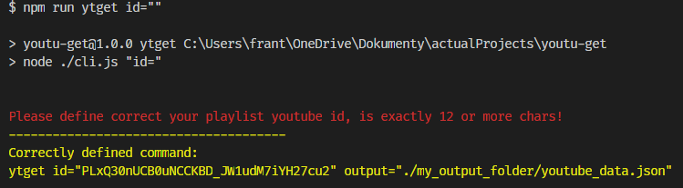
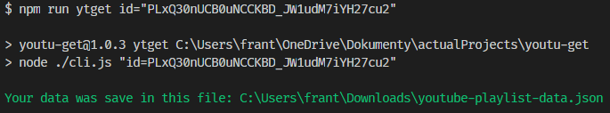
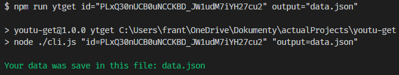

# youtu-get

is project which can get your all name of songs and url from your youtube playlist. It returns array with name of songs and url as objects and the returned data can be save as json file. As my example, but it is optional if you define `output` variable.

# [demo](https://youtu-get.lukasfrantal.com)


<hr>

## Instalation

```bash
npm i youtu-get -g
```

## Example running:

```bash
ytget id="PLxQ30nUCB0uNCCKBD_JW1udM7iYH27cu2" output="/yourOutputPath/youtube-playlist.json"
```

## You can use this package for your next solution like this:

```js
const { getYoutubeInfo } = require('youtu-get');

const idPlaylist = 'PLxQ30nUCB0uNCCKBD_JW1udM7iYH27cu2';
getYoutubeInfo(idPlaylist).then(data => console.log(data));
```

## If you want save output data yout can do it like this:

```js
const { getYoutubeInfo } = require('youtu-get');
const path = require('path');
const username = require('os').userInfo().username;

const idPlaylist = 'PLxQ30nUCB0uNCCKBD_JW1udM7iYH27cu2';

const outputPath = path.resolve(
  `/Users/${username}/Downloads/`,
  'youtube-playlist.json'
);

getYoutubeInfo(idPlaylist).then(data => {
  fs.writeFile(outputPath, JSON.stringify(data, null, 2), err => {
    if (err) console.error(err);
  });
});
```

## If you want check your youtube playlist id before running getYoutubeInfo function you can use this:

```js
const { getYoutubeInfo, isValidId } = require('youtu-get');
const path = require('path');
const username = require('os').userInfo().username;

const idPlaylist = 'PLxQ30nUCB0uNCCKBD_JW1udM7iYH27cu2';
const isValid = isValidId(id)
const outputPath = path.resolve(
  `/Users/${username}/Downloads/`,
  'youtube-playlist.json'
);
isValid ?
  getYoutubeInfo(idPlaylist).then(data => {
    fs.writeFile(outputPath, JSON.stringify(data, null, 2), err => {
      if (err) console.error(err);
    });
  });
  : console.error(`This youtube playlist id is not valid: ${idPlaylist}`);
```

## Expected incorrect result if you don't define your youtube playlist id:

<br>

## Expected correct result if you defined correct your youtube playlist id without defined output path:

<br>

## Expected correct result if you defined correct your youtube playlist id with defined output path:

<br>
